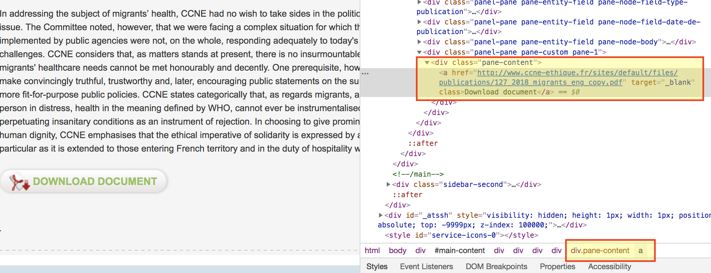
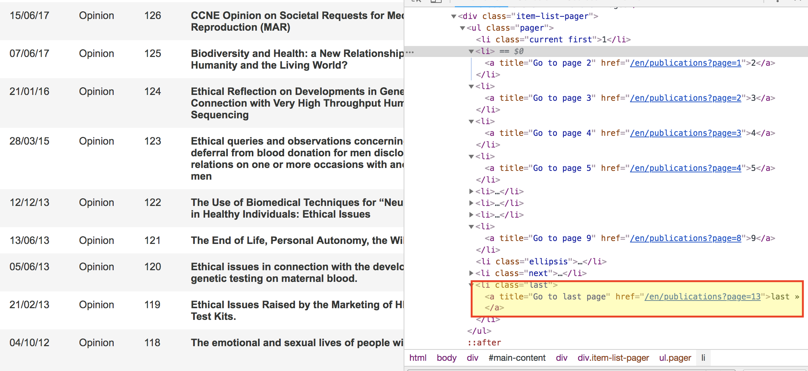

```{r setup, include=FALSE}
knitr::opts_chunk$set(echo = TRUE)
```

```{r load_packages, message=FALSE, warning=FALSE}
library(rvest)
library(dplyr)
library(glue)
library(pdftools)
```


# Problem

I study the emergence of new fields and categorization practices within the biomedical sciences, and bioethics is a key domain where academics and practitioners debate issues affecting patients, policies, and the organziation of societal risks. France has an interesting organization, called the __Comité Consultatif National d'Éthique__ (henceforth, CCNE), that provides ethical guidance for various policies. The [CCNE](http://www.ccne-ethique.fr/en) may help the President of France, the presidents of the National Assembly and Senate, higher education insitutions, various public organziations, and certain foundations. The CCNE was established in 1983 by the government and regularly releases opinions. 

I want to download all of the opinions released to date (127 in English, 128 in French). Given the relatively small number, this task could be accomplished manually, but I want to replicate it for several international organization. Thus, I will use R to automate it. 

# Getting the PDFs

I will obtain the opinion PDFs in two basic steps: get the file links and download the files. 

There are multiple ways to accomplish these tasks, but I will demonstrate two. 

## Obtain File Links with rvest

The [rvest](https://github.com/hadley/rvest) package is probably the best documented of the potential methods and was created by Hadley Wickham. It basically serves to facilitate work with the `xml2` and `httr` packages, which can be rather complex and difficult to use. There are multiple good tutorials for rvest, such as [this](https://www.datacamp.com/community/tutorials/r-web-scraping-rvest) one from DataCamp and [thus](https://blog.rstudio.com/2014/11/24/rvest-easy-web-scraping-with-r/) from RStudio. 

### CSS SelectorGadget

Before we can extract the links to the opinion files, we need to know where exactly in the underlying code for the webpage is housed the file paths. I will use the CSS selector. Luckily, one does not have to be a CSS/HTML expert (I certainly am not); [selectorgadget](https://selectorgadget.com/) provides a wonderful bookmarklet and Chrome extension (I use the latter).

Insert gif of selection process here. 

The main/first page for the CCNE opinions is this: http://www.ccne-ethique.fr/en/type_publication/avis. When you navigate to this link, you will see a list of the several latest opinions, and several "unofficial" opinions, which are not part of their formal opinion series. The latter will not have a number (in the No. field). You cannot download an opinion on this page; rather, you must click on the title (titre) of an opinion. If you click on the latest opinion, number 127, you will be directed to a page with a summary of the opinion and a button to download the PDF. The summaries are not consistently this long or detailed, so I want to actual files. 

The process to identify the CSS selector is quite simple. Click on the Chrome extension and then on the "Download Document" button. You will see that there are many other parts of the page that are highlighted in yellow, which is a problem. As such, I click on the CCNE link at the top left of the page to tell the selectorgadget that I do not want it; now, the only item highlighted is the button. The selectorgadget indicates that the CSS selector is _"#main-content a"_. Note: I repeated this process on multiple other opinion pages, and every repetition gave the same CSS selector.

### Using CSS Selector with rvest

Now that we know which part of the webpage we want, let's use rvest to get it. In the following code chunk, I load the package and set the webpage to scrape. 

```{r load_setpage}
# load package
library(rvest)

# set page
webpage <- read_html("http://www.ccne-ethique.fr/en/publications/ccnes-opinion-ndeg-127-migrants-health-and-ethical-imperatives")
```

Now, let's extract the information we want.

```{r}
pdf_link_incorrect <- webpage %>% 
  html_node("#main-content a") %>% 
  html_text()
pdf_link_incorrect
```

Oh no, something is wrong! The output says "Home". This obviously is not what we want, and the reason has to do with the (incorrect) CSS selector. Instead of using the selectorgadget, I will now look at the webpage code to see if I can get a better idea of the correct selector. 

Right click on the "download document" button, and choose inspect. You should then see a pane with the relevant code selected; see the image below. 




You can see that the selected section falls within a div section with a panel-content class and that the section immediately containing the pdf link has an a tag. The actual link is an href attribute. I, in this next chunk of code, use the new information to extract the link. 

```{r extract_link}
pdf_link <- webpage %>% 
  html_node("div.pane-content a") %>% 
  html_attr("href") 
```

Voilà! We now have the link, but how to get the pdf text into R? There are two options. I will show both, but I will only use the second.

First, you might want to download the file onto your hard drive (or server). I will not execute the following code.

```{r download_pdf, eval = FALSE}
download.file(pdf_link,
              "./opinion.pdf")
```
The first piece of required input is the pdf link (`pdf_link`), and the second is the file destination on your local drive or server. 

However, I do not want to download the actual files; I just want the text. There are multiple packages that will read text from pdf files, but I will use the pdftools package. By using the `pdf_text` function, we can go directly from the `pdf_link` object to a new object containing the opinion text, bypassing the need to save the pdf file.

```{r read_opinion_text}
library(pdftools)
opinion <- pdf_text(pdf_link)
```

This works! I will postpone a detailed examination of the `opinion` object for later. However, there is a key limitation to this approach: we need the links to 127 (English) documents, so let's focus on getting the rest of them. The ideal way to do so would be to set up a crawler to go through the site for us, but that's a bit advanced for this workshop. For now, we will strategically going through the relevant sections of the site and select only what we want.   

## Getting ALL the Opinions

To recap, the previous approach will largely work for downloading all opinions; we just need to expand it a bit. From each *opinion's* page, we selected the *pdf* link that we then read the PDF's text into an R object. The problem now is twofold: (1) collect all the page urls for each opinion and (2) connect these to the previous workflow. 

The major problem with this website is that it does not list all the opinions on a single page and that the structure of the first and all other publication pages' url differs. The general set of tasks is as follows:

    1. Gather all the CCNE opinion links for a single page of publications section
    2. Repeat for every page of publications section
    3. Combine information into a single object

### Main (Publication) Pages

In this section, I want to explore each main page of the publications section and to get the link to the page with information about each opinion and its pdf link. 

```{r links_from_single_mainpage}
# set page
webpage_pubs <- read_html("http://www.ccne-ethique.fr/en/publications")

# get links for each publication page associated with these titles
pub_page_links <- webpage_pubs %>% 
  html_nodes("td.views-field.views-field-title a") %>% 
  html_attr("href")

# print result
pub_page_links
```

As you can see, `pub_page_links` contains a link from the landing publications page (`webpage_pubs`), but it is relative: we cannot enter it into a browser and be taken to the publication's page. Rather, we need to "complete" the url with that of the main site. The following code chunk uses the glue package to accomplish this task. 

```{r complete_pub_page_links}
# complete links (with initial site info)
pub_page_links <- glue("http://www.ccne-ethique.fr/{pub_page_links}")
```

We now have a character vector of ten complete urls to each of the CCNE opinions that are listed on the main publications landing page. I write, in the next bit of code, a function that takes these links and returns the links to each page's opinion pdf. 
```{r get_pdf_function_1}
# function to get pdf links from each page (row) above
get_pdf_link <- function(pub_page_link){
  pdf_link <- read_html(pub_page_link) %>% 
    html_node("div.pane-content a") %>% 
    html_attr("href")
}

# apply to all links pub_page_links
pdf_links_10 <- lapply(pub_page_links, get_pdf_link) %>% 
  unlist() %>% 
  as_tibble() %>% 
  rename(pdf_link = value)

# print result
pdf_links_10
```
There are a few things to note here. The function take *a single publication page* and returns its pdf link, and, after writing that, I use `lapply()` to apply this function to each url within `pub_page_link`, after which I collapse the resultant list into a tibble. In many cases, you can use `bind_rows()` from the dplyr package after `lapply()`, but, because `bind_rows()` relies on column names, it does not work in this instance; this issue is why pipe into the `unlist()`-`as_tibble()`-`rename()` chain. 

However, there is a big issue: the fourth row does not contain a pdf link. The entry is for a footnote on that page, which can be resolved with effort (that is not easily generalizable to other problems), but I will, for the time being, simply rewrite the function to replace this value with an NA. I use the rule that each url should contain "pdf". 

```{r get_pdf_function_2}

# function to get pdf links from each page (row) above
get_pdf_link <- function(pub_page_link){
  pdf_link <- read_html(pub_page_link) %>% 
    html_node("div.pane-content a") %>% 
    html_attr("href") 
  
  if(!stringr::str_detect(pdf_link, "\\.pdf")) {
    pdf_link <- NA
  }
  
  return(pdf_link)
}

# apply to all links pub_page_links
pdf_links_10 <- lapply(pub_page_links, get_pdf_link) %>% 
  unlist() %>% 
  as_tibble() %>% 
  rename(pdf_link = value)

# print result
pdf_links_10
```

### All Publication Pages

In the last section, we took a single "main" page of the CCNE website's publication section, where 10 opinions are listed and where we can find the url for each of those opinions' webpage. We obtained a part of each of the 10 urls and then completed. Next, we wrote a function to extract the pdf link contained within each of the publication webpages. The task now is to repeat this process for each "main" publication page. 



Using the CSS selector identified in Figure 2, I now extact the html attribute for the last page, just to make inspection easier. 
```{r}
# get total number of pages
webpage_pubs %>% 
  html_nodes("ul.pager li.last a") %>% 
  html_attr("href")
```
This part of the url indicates 13 as the page number, but, if you compare carefully this url with the initial page ("http://www.ccne-ethique.fr/en/publications"), you should notice that they have distinct structures. The page number for page two begins with one, and the structure for the remaining pages remains the same. We thus have a total of 14 "main" publication pages.

The next code chunk creates `all_main_pages`, which creates character vector of all main page urls. 
```{r}

### get list of all publication (main) pages

# first page has unique url
first_page <- "http://www.ccne-ethique.fr/en/publications"

# create numeric vector to input into url vector
numbers <- seq(from = 1, to = 13, by = 1)

# rest (2-13): common format
other_pages <- glue("http://www.ccne-ethique.fr/en/publications?page={numbers}")

# combine first_page and other_pages and make tibble
all_main_pages <- c(first_page, other_pages) #%>% 
  #as_tibble() %>% 
  #rename(main_pagelink = value)

# print result
all_main_pages

```


In a previous section, I extracted all the publication pages for opinions listed on the main "main" page. Now, I want to use the list of all "main" pages as input and receive as output all of the publication pages. 

This section includes the `get_pub_pages` function, which is very simple and requires the url to one of the main pages. The following line of code applies this function to `all_main_pages`. 
```{r}
# create function to get each publication's link from each "main page"
get_pub_pages <- function(main_page){
  read_html(main_page) %>% 
  html_nodes("td.views-field.views-field-title a") %>% 
  html_attr("href")
}

# apply function to all main pages
all_pub_pages <- lapply(all_main_pages, get_pub_pages)

# check out object
class(all_pub_pages)
length(all_pub_pages)
```
Applying the function to all main pages returns a list of 14 elements because there are 14 main pages. 


```{r}
all_pub_pages[[1]]
```

However, examining the first element of `all_pub_pages` shows that they are again not urls that will permit R to navigate to the pages. Thus, I need to complete them.
```{r}

# complete url NOT USING GLUE DUE TO POTENTIAL VECTORIZATION ISSUE???
#all_pub_pages <- lapply(all_pub_pages, function(x){
#  as_tibble(x) %>% 
#    rename(partial_pub_page_link = value) %>% 
#    mutate(full_pub_page_link = #glue("http://www.ccne-ethique.fr{partial_pub_page_link}"))})

# complete url
all_pub_pages <- lapply(all_pub_pages, function(x){
  as_tibble(x) %>% 
    rename(partial_pub_page_link = value) %>% 
    mutate(full_pub_page_link =
             paste0("http://www.ccne-ethique.fr", partial_pub_page_link))})

# collpase into tibble
all_pub_pages <- bind_rows(all_pub_pages)

# check out result
class(all_pub_pages)
dim(all_pub_pages)
names(all_pub_pages)
head(all_pub_pages, 10)
```
Using `lapply()`, I create a new variable, named `full_pub_page_link`, within each list element containing the full url, and I then use bind rows to collapse the list into a tibble. I am able to do so now because I named both columns (i.e., `partial_pub_page_link` and `full_pub_page_link`). I commented out a section of code that warrants mention. You may use the `glue()` command to accomlish the same work as `paste0()`, but vectorization creates a poential issue. Even though the results seemed fine with `glue()`, I sided with `paste0()` to be safe.

## Returning to Text Import

Now that we have completed the three tasks (i.e., gather all the CCNE opinion links for a single page of publications section, repeat for every page of publications section, and combine information into a single object), we need to get the text from the CCNE opinion pdfs. I earlier illustrated two ways of doing this: you can, using the pdftools package, download the files or read the text of each directly into R. I will opt for the latter.

But, before doing that, let's use the `get_pdf_link()` function from earlier to get every pdf link based upon `all_pub_pages$full_pub_page_link`.

PROBLEMS FROM HERE DOWN!
```{r get_all_pdf_links}
all_pdf_links <- lapply(all_pub_pages$full_pub_page_link, get_pdf_link) #%>% 
  #as_tibble() %>% 
  #rename(pdf_link = value) %>% 
  #bind_rows()
```

```{r}
list <- vector(mode = "list", length = nrow(all_pub_pages))
for i in 1:nrow(all_pub_pages){
  list[[i]] <- get_pdf_link(all_pub_pages[i,2])
}
```


```{r}
opinion_texts <- lapply(all_pub_pages$full_pub_page_link, pdf_text) 
  
```

